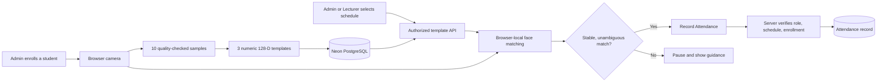

# KBU Smart Attendance System

> A role-based university attendance platform with privacy-conscious, browser-based face recognition.

[Live Demo](https://kbu-smart-attendance-system.vercel.app) · [Report a Bug](https://github.com/HtetKoOo/Smart-Attendance-system/issues) · [Request a Feature](https://github.com/HtetKoOo/Smart-Attendance-system/issues)

## Overview

KBU Smart Attendance System helps administrators and lecturers manage academic data and record classroom attendance. A web camera generates a numeric face descriptor in the browser, compares it with enrolled student templates locally, and sends only verified student and schedule identifiers to the server when attendance is recorded.

This is an academic and portfolio project. Face recognition is an assistive attendance workflow, not an identity-verification or anti-spoofing system.

## Key Features

### Role-based workflows

| Role | Capabilities |
| --- | --- |
| **Admin** | Manage student and lecturer profiles, courses, classrooms, schedules, enrollments, face enrollment, recognition calibration, attendance recording, and CSV-ready history reports. |
| **Lecturer** | View students enrolled in assigned courses, record attendance, and review history only for schedules assigned to that lecturer. |
| **Student** | Create an account and access the student dashboard. |

### Academic management

- Link registered accounts to student or lecturer profiles.
- Create, edit, search, and remove students, lecturers, courses, classrooms, and class schedules.
- Enroll students in courses with duplicate-enrollment protection.
- Display a lecturer's course roster with server-side ownership checks.

### Face enrollment and recognition

- Capture **10 quality-checked samples**: frontal, slightly left, and slightly right.
- Generate and store **three normalized 128-dimensional numeric templates** per student.
- Process camera frames and live descriptors in browser memory; raw photos and videos are never stored.
- Match templates locally using Euclidean distance.
- Require consecutive consistent matches, briefly lock stable results to reduce UI flicker, and pause on multiple or unknown faces.
- Protect against close matches with best-versus-second-best ambiguity detection.
- Provide an admin-only calibration screen for controlled threshold testing without changing production attendance settings.

### Attendance safeguards

- Only Admins and schedule-owning Lecturers can record attendance.
- The server verifies the selected schedule, course enrollment, user role, and lecturer ownership.
- Each student can only be recorded once per class schedule per date through database-level duplicate protection.
- Attendance payloads deliberately exclude camera frames and biometric descriptors.
- Admins can filter recorded attendance by date range, class schedule, and status, then export the selected history as CSV.
- Lecturer attendance history is server-scoped to only the class schedules assigned to that lecturer.

## Architecture



## Technology Stack

| Area | Technology |
| --- | --- |
| Frontend | Next.js 16, React 19, TypeScript, Tailwind CSS, shadcn/ui |
| Authentication | Better Auth with email/password sessions and role-based access control |
| Backend | Next.js Route Handlers |
| Database | PostgreSQL on Neon, Prisma ORM |
| Face processing | `@vladmandic/face-api`, browser camera APIs, locally hosted model weights |
| Deployment | Vercel |

## Privacy and Security Notes

- Camera frames, screenshots, and video streams are not uploaded or stored by this application.
- The database stores only numeric face templates associated with student records.
- Recognition runs in an authorized browser after templates are loaded through protected API routes.
- Admin-only enrollment and calibration routes enforce server-side role checks.
- Attendance recording validates roles, lecturer ownership, schedule enrollment, input shape, date format, and duplicate records on the server.

## Getting Started

### Prerequisites

- Node.js 20 or newer
- pnpm 11 or newer
- A PostgreSQL database (Neon is recommended for this project)

### 1. Clone and install

```bash
git clone https://github.com/HtetKoOo/Smart-Attendance-system.git
cd Smart-Attendance-system
pnpm install
```

### 2. Configure environment variables

Copy the example file and replace every value with your own credentials:

```bash
cp .env.example .env
```

Required variables:

```env
DATABASE_URL="postgresql://..."
DIRECT_URL="postgresql://..."
BETTER_AUTH_SECRET="use-a-long-random-secret-at-least-32-characters"
BETTER_AUTH_URL="http://localhost:3000"
NEXT_PUBLIC_APP_URL="http://localhost:3000"
```

For production, set `BETTER_AUTH_URL` and `NEXT_PUBLIC_APP_URL` to the deployed HTTPS URL. Never commit `.env` files or expose `BETTER_AUTH_SECRET`.

### 3. Prepare the database

```bash
pnpm prisma migrate deploy
pnpm prisma generate
```

For local schema development, use `pnpm prisma migrate dev` instead of `migrate deploy`.

### 4. Start the application

```bash
pnpm dev
```

Open [http://localhost:3000](http://localhost:3000).

### Quality checks

```bash
pnpm prisma validate
pnpm prisma generate
pnpm lint
pnpm typecheck
pnpm test
pnpm build
```

GitHub Actions runs the same lint, typecheck, unit-test, and production-build checks on every push and pull request.

## Demo Flow

1. Register an account. Public registration creates a `STUDENT` role by default.
2. An Admin links registered accounts to student or lecturer profiles.
3. An Admin creates courses, classrooms, schedules, and course enrollments.
4. An Admin enrolls a student's face using the 10-sample guided capture process.
5. An Admin or the assigned Lecturer selects a schedule and starts the camera.
6. After a stable, unambiguous recognition result, select **Record Attendance**.
7. The server verifies the request before creating an idempotent attendance record.

## Screenshots to Add

For a stronger portfolio presentation, add screenshots in `docs/screenshots/` and link them here:

- Landing page and login screen
- Admin dashboard on desktop and mobile
- Student/lecturer account-linking dialog
- Face enrollment sample-progress screen
- Face recognition result and ambiguity state
- Attendance History report with filters and CSV export
- Attendance recording screen and recent attendance list

## Current Limitations and Future Work

- No liveness detection or anti-spoofing; the system must not be used as a high-security identity system.
- Automatic late-status evaluation and student attendance self-service are future enhancements.
- Threshold values need controlled, consented real-world calibration before broader use.
- Automated unit, API integration, and end-to-end test coverage are planned.
- A formal biometric consent, retention, deletion, and access policy is required before institutional deployment.

## Project Status

The core academic workflow, multi-template enrollment, local recognition test, protected attendance recording, and admin attendance reporting are complete as a portfolio-ready prototype. The project is actively being improved with stronger testing and production hardening.

## License

This project is currently intended for educational and portfolio use. Add an explicit license before accepting external contributions or reusing it commercially.
